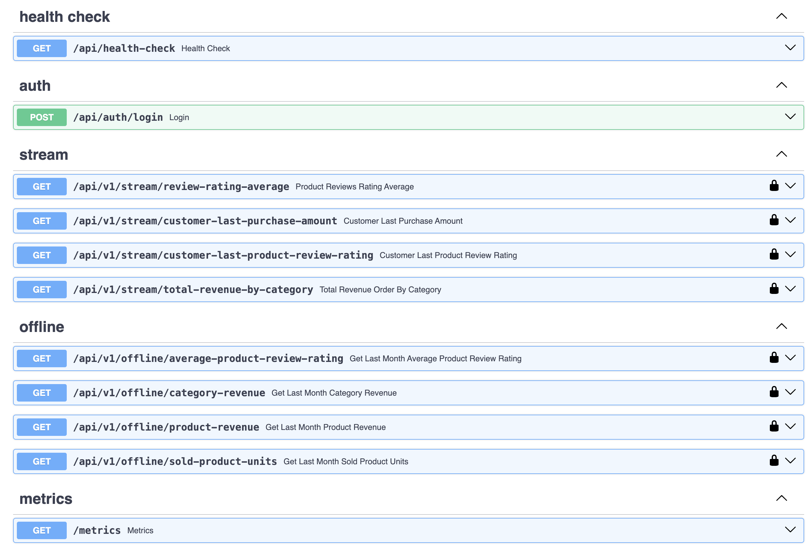

# Feature Store System

## Design of System  
- System design document is available on [System Design Reference](SystemDesign.md)

---

## System Structure
The project structure is as follows:

| **Type**               | **Name**                      | **Description**                                                                            |
|------------------------|-------------------------------|--------------------------------------------------------------------------------------------|
| **Directory**          | `airflow/`                    | Contains configurations and DAGs for orchestrating workflows and managing dependencies.    |
| **Directory**          | `batch/`                      | Batch processing scripts and configurations, particularly for generating offline features. |
| **Directory**          | `consumer/`                   | Code for consuming and processing real-time data from Kafka, storing results in Redis.     |
| **Directory**          | `data/`                       | Includes sample datasets and raw data for testing and development.                         |
| **Directory**          | `producer/`                   | Code for producing or simulating real-time data streams for Kafka.                         |
| **Directory**          | `resources/`                  | Auxiliary resources like configuration files, and documentation images.                    |
| **Directory**          | `src/`                        | Main source directory for core application logic for Feature Store API .                   |
| **Directory**          | `tests/`                      | Unit and integration tests to ensure application reliability and correctness.              |
| **File**               | `.coveragerc`                 | Configuration file for measuring code coverage during tests.                               |
| **File**               | `.flake8`                     | Linting configuration to enforce Python code style.                                        |
| **File**               | `.gitignore`                  | Specifies files and directories to be ignored by Git.                                      |
| **File**               | `.pre-commit-config.yaml`     | Configuration for pre-commit hooks to enforce code quality checks before committing.       |
| **File**               | `application_start.sh`        | Script to start the application, initializing services or components.                      |
| **File**               | `datasource.yml`              | Configuration file defining data sources for database or API connections.                  |
| **File**               | `default.batch.env`           | Environment variables specific to batch processing services.                               |
| **File**               | `default.env`                 | General environment variables used across the application.                                 |
| **File**               | `docker-compose.yml`          | Defines services, networks, and volumes for Docker containerized environments.             |
| **File**               | `docker-compose-batch.yml`    | Variant of Docker Compose file tailored for batch processing.                              |
| **File**               | `Dockerfile`                  | Instructions for building the application Docker image.                                    |
| **File**               | `main.py`                     | Entry point for the application.                   |
| **File**               | `prometheus.yml`              | Configuration file for Prometheus, used for monitoring and alerting.                       |
| **File**               | `pytest.ini`                  | Configuration for running tests with pytest, including options and settings.               |
| **File**               | `Readme.md`                   | Main README file with an overview, installation instructions, and usage guidelines.        |
| **File**               | `requirements.txt`            | Lists the Python dependencies required to run the application.                             |
| **File**               | `SystemDesign.md`             | Detailed system design documentation outlining architecture, components, and design decisions. |
| **File**               | `wait-for-it.sh`              | Script to wait for services to be ready before starting dependent services, useful for Docker. |

---
## System Components
All components of the system are described below (All services are dockerized and run with docker-compose files)

### Feature Engineering and Batch Processing
#### Producer 
- The producer directory contains code for producing or simulating real-time data streams for Kafka.
- The producer simulates e-commerce transactions data and sends events to Kafka topics.
- Producer service logic is implemented in `producer/customer_product_producer.py` file.

#### Realtime/Streaming Features
- Feature engineering logic for real-time features is implemented in the `consumer` directory.
- Flink is used for processing real-time data streams from Kafka topics.
- Data is consumed from Kafka topics, processed, and stored in Redis for low-latency access.
- Data processing logic is implemented in `consumer/flink_customer_product_stream_consumer.py` file.
- Real-time features include:
  - The average of the last 5 reviews a product has received. Logic is implemented in `consumer/map_reduce/average_last_5_reviews_map_reduce.py`.
  - The revenue obtained from a category for the last 3 orders. Logic is implemented in `consumer/map_reduce/total_revenue_last_3_order_by_category_map_reduce.py`.
  - The amount paid for the customer's last purchase. Logic is implemented in `consumer/map_reduce/customer_last_order_amount_map_reduce.py`.
  - The review rating a customer gave to a product. Logic is implemented in `consumer/map_reduce/consumer/map_reduce/customer_product_review_rating_map_reduce.py`.
- Map Reduce logics are used for processing of real-time features.
- Real-time features are stored in Redis for low-latency access.
- FIFO queue is used for storing the last 5 reviews of a product and last 3 orders of a category.
- State management is used for storing the last purchase amount of a customer and the review rating of a customer for a product.
- Real-time features are updated in Redis with each new event received from Kafka.
- Real-time features are consumed by the Feature Store API for serving real-time features.

#### Batch Features
- Feature engineering logic for batch features is implemented in the `batch` directory.
- Batch processing scripts are used for generating offline features.
- Batch features are generated by processing e-commerce transactions data from the Hive Data Lake.
- Spark is used for processing e-commerce transactions data from the Hive Data Lake.
- Testing Data initialized with `docker-compose-batch.ymal/services.hive-server-init-db` service. Ensure that the service is running before starting the batch processing.
- PySpark is used for writing Spark jobs.
- Batch features include:
  - The average rating of reviews for a product in the last 30 days. Logic is implemented in `batch/job_average_product_review_last_30_days.py`.
  - The total number of units sold for a product in the last 30 days. Logic is implemented in `batch/job_units_sold_last_30_days.py`.
  - The revenue generated by a product in the last 30 days. Logic is implemented in `batch/job_revenue_by_product_last_30_days.py`.
  - The revenue generated by a category in the last 30 days. Logic is implemented in `batch/job_revenue_by_category_last_30_days.py`.

- Batch features are stored in the Redis for serving batch features.
- Batch features are updated in Redis with each new batch processing job.
- Batch features are consumed by the Feature Store API for serving batch features.
- Batch processing jobs are scheduled and orchestrated with Apache Airflow.
- Airflow DAGs are used for defining workflows, dependencies, and scheduling of batch processing jobs.
  - Airflow DAGs are used for defining workflows, dependencies, and scheduling of batch Spark processing jobs.
  - Airflow operators are used for executing Spark jobs.
  - Airflow sensors are used for waiting for the completion of Spark jobs.
  - Airflow DAGs located in the `airflow/dags` directory.

### Feature Store API
- Feature Store API programming language is Python. Services coded with Python programming language.
- Rest API framework is FastAPI (https://fastapi.tiangolo.com/). Swagger and OpenAPI documentation are automatically generated with FastAPI.
- Authentication and Authorization works with JWT token.
- The API includes monitoring system with Prometheus and Grafana.
- The API includes tracing system with opentracing and JAEGER
- The API includes Swagger UI and openapi documentation
- The API works with Redis adapter for serving real-time and batch features.
- pre commit hook uses for formatting, code styling, and static typing (black, flake8, and mypy)
- While coding, attention was paid to clean code principle, DRY, KISS and SOLID principles.
- pytest library uses for testing
- The API includes version structure for HTTP requests
- Dependency Injection uses service between adapters.
- Logging manages with python logging package as singleton configuration
- All data models are available on Swagger UI 
- The API includes exception handling logics
- Error handling works with integer error codes. Error messages are in **src/infra/util/errors.py:1**
- `api/v1/stream` base path includes endpoints for serving real-time features.
- `api/v1/offline` base path includes endpoints for serving batch features.
- `api//auth` base path includes endpoints for authentication and authorization.
- `api/health-check` base path includes health check endpoint.
- `/metrics` base path includes Prometheus metrics endpoint.
- The API controller logics are implemented in `src/api/controller` directory.
- The API service logics are implemented in `src/core/service` directory.
- The API adapter logics are implemented in `src/infra/adapter/repository` directory.
- The API adapter interfaces are implemented in `src/core/port` directory.
- The API test logics are implemented in `tests` directory.

---

## Building and running the applications

Copy default environment variables to .env for API and real streaming applications
```bash
cp default.env .env
```
Copy default environment variables to .env for batch process applications
```bash
cp default.batch.env batch.env
```

Run below command to **run** the application and real streaming applications
```bash
docker-compose up --build
```
Run below command to **run** the batch process applications
```bash
docker-compose -f docker-compose-batch.yml up --build
```

Run below command to **test** the application
````bash
docker-compose -f docker-compose.yml run tests
````

### Using of Feature Store API
- Ensure that the redis and batch-redis services are running before starting the Feature Store API.
- Authentication and Authorization is required for all endpoints. JWT token should be added to the request header.
- Get JWT token from **/api/v1/auth/login** endpoint with below credentials
  - email, password fields are required for login. 
  - Any email and password can be used for login. System allows all credentials for login.
  - After login, JWT token will be returned in response. `access_token` field should be added to the request header for all endpoints.
  - JWT token should be added to the request header with below format
  - ```Authorization: Bearer {JWT_TOKEN}``` 
  - Authorization system allows all permissions for all users.

#### Swagger UI 
- **URL :** http://localhost:8000/
- **Openapi document URL :** http://localhost:8000/openapi.json
- The project can manually test on swagger UI
- Endpoints request and response models are available on swagger UI



#### Test Coverage of Project
- Application has 90% test coverage.
- Test files are in tests folder. Also, you can reach test coverage report  after running of tests from **coverage-reports/coverage-api.html/index.html** file


#### Monitoring of the API with Prometheus and Grafana
- Prometheus is an open-source monitoring and alerting toolkit. It scrapes metrics from instrumented jobs, either directly or via an intermediary push gateway for short-lived jobs.
- **Prometheus URL :** http://localhost:9090/
- Grafana is an open-source platform for monitoring and observability. 
- Application metrics can be viewed on Grafana UI. Dashboard file is available for Feature Store API on **resources/feature-store-api-load-stress-test.jmx** file.
- **Grafana URL :** http://localhost:3000/
- UI Credentials;  username: **admin** password: **admin**
- Should import **resources/grafana-dashboard.json** file to Grafana import dashboard section for Feature Store API.


#### Tracing of the API with Jaeger
- Jaeger is a distributed tracing system. It is used for monitoring and troubleshooting microservices-based distributed systems.
- All endpoints, services, and adapters are traced with Jaeger. Traces can be viewed on Jaeger UI.
- **URL :** http://localhost:16686/


### Stress Test with Jmeter for Feature Store API
- Test scenario worked with 10 users and 1000 loops and 3 second ramp-up period for each user.
- Total number of requests is 80000.
- Test scenario file is **resources/feature-store-api-load-stress-test.jmx**

Summary Report


Response Time Graph


Monitoring on Grafana


---

## Challenges Faced
- Creating dockerized services of batch processing and real-time processing for local testing environment. Because of the complexity of the system, it was hard to manage all services in a local environment.
- Deciding on the right technology for data lake, operational database, real-time processing and batch processing.

## Improvements That Need to Be Made
- Flink uses HEAP memory for state management. For high volume of data, state management should be moved to database for scalability and consistency.
